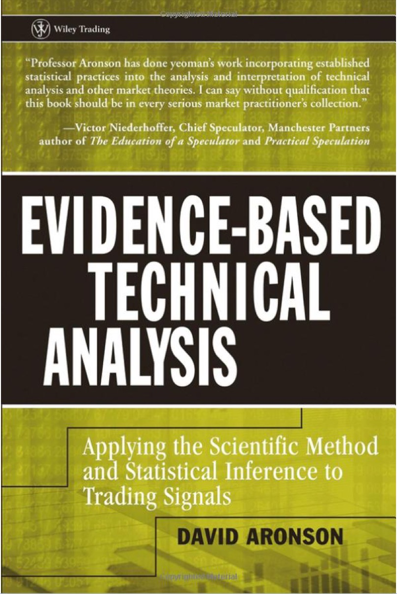

# Evidence-Based Technical Analysis



EBTA是关于如何将科学方法论与统计推论引入技术分析中，从而更加科学、无偏的应用技术分析信号。在接下来的章节中，Zihao X和Chang D将分享阅读EBTA的笔记和心得，同时在最后两章的case study中，相比原文在美股市场上的实践，我们将尝试在A股数据中展开应用与讨论。

具体而言，我们将使用Python作为实践本书的第一语言，一些基础的package将会是默认使用的，例如Numpy、Pandas；

```python
pip install numpy pandas
```

为了避免数序符号可能引起的歧义，即使是较为常见的，例如数学期望$\mathbb{E}$，我们也保持与原文一致，并在使用前定义声明。那么，接下来，欢迎与我们一同踏上交易信号探索之旅。